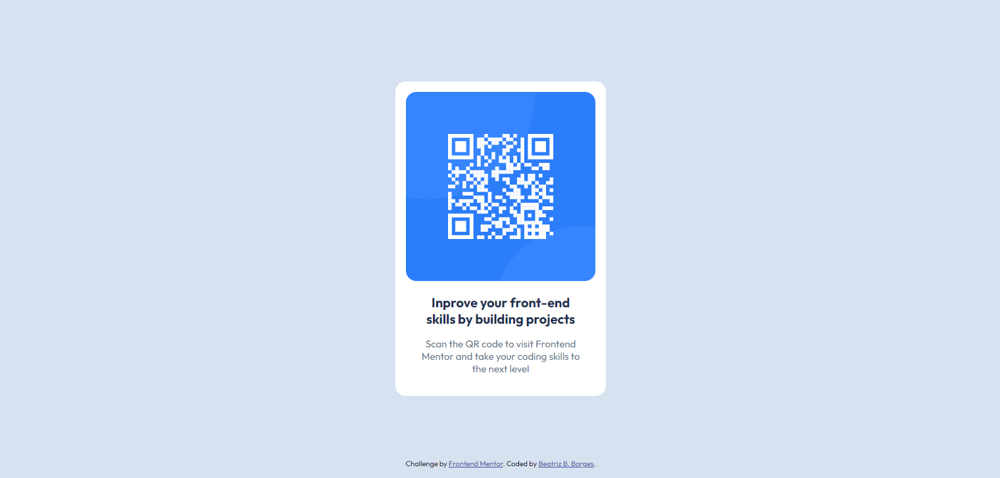

# Frontend Mentor - QR code component solution

This is a solution to the [QR code component challenge on Frontend Mentor](https://www.frontendmentor.io/challenges/qr-code-component-iux_sIO_H). Frontend Mentor challenges help you improve your coding skills by building realistic projects. 

## Table of contents

- [Overview](#overview)
  - [Screenshot](#screenshot)
- [My process](#my-process)
  - [Built with](#built-with)
  - [What I learned](#what-i-learned)
- [Author](#author)

## Overview

### Screenshot

## My process

### Built with

- **HTML5** - Estrutura do componente
- **CSS3** - Estilização e layout responsivo
- **Google Fonts (Outfit)** - Tipografia
- **Frontend Mentor** - Desafio baseado no design

### What I learned

Durante o desenvolvimento deste projeto, aprendi e reforcei os seguintes conceitos:

- **Uso de Flexbox e Layout Responsivo:** Aprendi a centralizar elementos corretamente utilizando `display: flex`, `justify-content: center` e `align-items: center`, garantindo um layout bem estruturado.
- **Posicionamento Absoluto para Rodapés Fixos:** Para manter a seção de atribuição sempre no final da página, utilizei `position: absolute; bottom: 16px;` dentro do `body`.
- **Melhoria na Tipografia com Google Fonts:** Utilizei a fonte *Outfit* do Google Fonts para tornar o design mais fiel ao modelo original.
- **Prática com Design System e Hierarquia de Cores:** Trabalhei com variáveis de cores em HSL para manter a harmonia do design.
- **Aprimoramento na Estruturação do Código:** Mantive um código organizado e limpo, seguindo boas práticas de HTML e CSS.

Este projeto me ajudou a reforçar minha experiência com estilos modernos e responsividade. 🚀

## Author

- Frontend Mentor - [@BeatrizBastosBorges](https://www.frontendmentor.io/profile/BeatrizBastosBorges)
